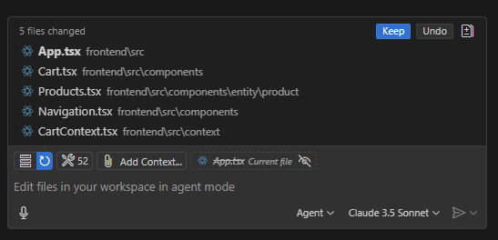

# **GitHub Copilot Agent Mode exercise**

This app will be used to show the following Copilot features:

- **Agent Mode and Vision**: generate a fairly complex UI updated (add the Cart functionality to the site) all with a natural language prompt and an image
- **Unit Testing**: run and generate unit tests to improve coverage


### **Description**

- **About the App:** This is a modern TypeScript web-app with separate API and Frontend (React) projects that you will enhance with Copilot Agent Mode, and Vision.
- **Why:** Demonstrate how Copilot can analyze and enhance existing code automatically, understand images, vulnerabilities and testing.


### **Building, Running and Debugging the code**

Refer to [the build docs](./build.md). Ensure that you are able to build and run the application successfully before starting the exercise.


### **Exercise: Using Vision and Agent to Generate Cart Functionality**  

- **What to show:** "Vibe coding" using Agent Mode and Vision to complete complex tasks. Also, we will re-use prompts to steamline AI-native workflow
- **Why:** Demonstrate how Copilot Vision can detect design and how Agent can understand a codebase and create complex changes over multiple files
- **How:**  
 
  1. First, create a new feature branch to isolate your changes. 
     - Open a new terminal in VS Code `Terminal > New Terminal` and run the following commands:
     ```bash
     # Make sure you're on the main branch and it's up to date
     git checkout main
     git pull

     # Create and checkout a new feature branch
     git checkout -b feature/cart

     # Verify you're on the new branch, you should see `feature/cart` listed first in the terminal with an asterisk (*) next to it
     git branch
     ```
  2. Take a look at the [`plan`](../.github/prompts/plan.prompt.md) prompt.
     - This prompt is used to generate a plan for the changes you want to make. It will analyze the code and suggest changes.
     - You can also use this prompt to ask Copilot to generate a plan for the changes you want to make.
     - The plan will be used to generate the changes in the code.
  
  3. Open Copilot Chat and switch to "Ask" mode. Add the [`plan`](../.github/prompts/plan.prompt.md) prompt to the chat using `#file` variable or by selecting the paperclip icon and selecting `prompt` in the file options list.
  4. Attach the [cart image](../docs/design/cart.png) using the paperclip icon or drag/drop to add it to the chat.
  5. Enter this prompt:
    ```txt
    I need to implement a simple Cart Page. I also want a Cart icon in the NavBar that shows the number of items in the Cart.
    ```
   Copilot would suggest changes and plan the components to add/modify and even ask clarifying questions.

  6. Answer some of the questions if you want to refine the plan. Check that the prompt file is still attached to the chat, re-add it if not.
     - For example, you can say `I want to use local storage to persist cart across page refreshes`.
    <todo>
  7. Switch to "Agent" mode in Copilot Chat. Switch to `Claude 3.7 Sonnet` (a good implementation model) and enter this prompt:

    ```txt
    Implement the changes. 
    ```
  8. See how Copilot is making the changes in the files and you can `Keep/Undo` each one.
   

  9.  As part of implementing the new Cart functionality, the Agent mode might run a command in the terminal. For example, to build the frontend to ensure no errors.
  10. Once the changes are completed, perform the following steps to test the changes:
         1.  In the terminal, run `npm run build --workspace=frontend` to build the frontend app.
         2.  In the terminal, run `npm run dev` 
         3.  Open the Frontend app (it runs on port 5137).
         4.  Navigate to Products. Add items to the cart (note the icon updating). Click on the Cart icon to navigate to the Cart page. See the total, and adding/removing items from the cart.
  11. Once you are happy with the changes, you can end the session in Copilot Chat by clicking on `Done`. Note that you can also see which files it has changed and have the option to discard the changes or undo all changes if you do not like what GitHub Copilot has done.
  
  12. Run the following commands to commit and push the changes:
    ```bash
    git add .
    git commit -m "Add Cart functionality"
    git push origin feature/cart
    ```

### **Generate unit tests for the Cart functionality**  

- **What to show:** Generate unit tests with the help of GitHub Copilot.
- **Why:** Demonstrate how Copilot can generate unit tests for the new Cart functionality.
- **How:**  
  1. Switch to `Agent` mode
  2. Ask Copilot to `Create unit tests for the Cart component that verify proper rendering and functionality`
  3. See the generated tests
  4. Accept the changes
  5. Ask Copilot to run the tests   
  6. See the test results in the terminal

## **Key Takeaways**  

- Agent Mode handles multi-step changes across multiple files — saving time.
- Vision enables Copilot to understand images
- Command execution allows Copilot to self-heal and run commands

